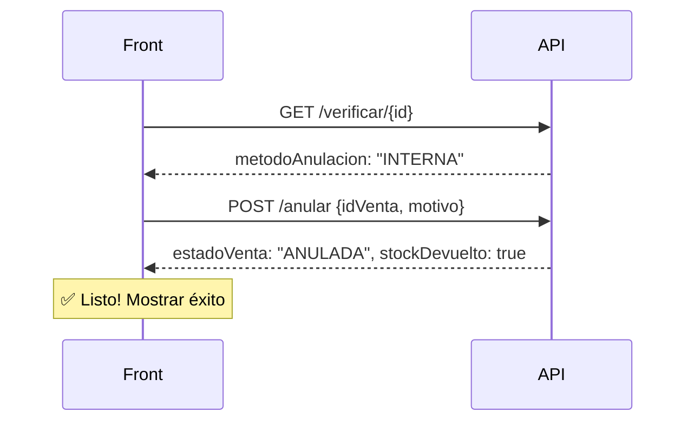
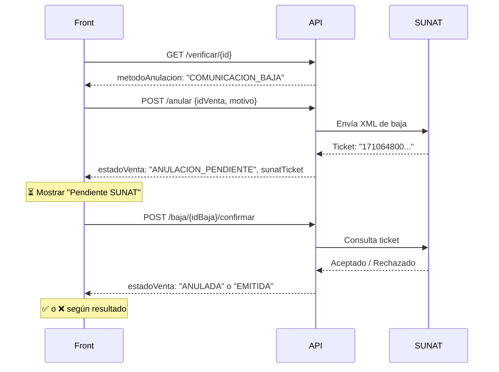
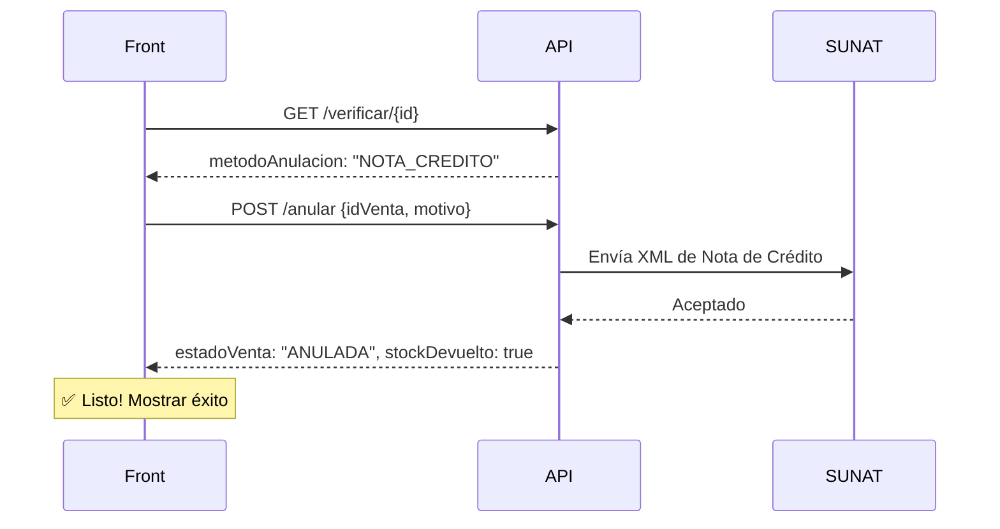

# 📄 Documentación API de Anulación de Ventas

> [!IMPORTANT]
> **Base URL:** `/api/anulacion`
> **Autenticación:** Todas las rutas requieren JWT Bearer Token en el header `Authorization`.

---

## 🔍 1. Verificar si una venta se puede anular

**`GET /api/anulacion/verificar/{idVenta}`**

Pre-verifica si una venta se puede anular y qué método de anulación le corresponde. **Llamar ANTES de mostrar el modal de confirmación.**

### Request

```
GET /api/anulacion/verificar/52
Authorization: Bearer eyJhbGciOi...
```

No necesita body.

---

### ✅ Respuesta exitosa — Nota de Venta (se puede anular)

```json
{
  "idVenta": 52,
  "serieCorrelativo": "NV01-00000012",
  "tipoComprobante": "NOTA DE VENTA",
  "estadoVenta": "EMITIDA",
  "sunatEstadoVenta": "NO_APLICA",
  "fechaEmision": "2026-03-15T14:30:00",
  "diasDesdeEmision": 2,
  "puedeAnularse": true,
  "metodoAnulacion": "INTERNA",
  "razonNoAnulable": null
}
```

### ✅ Respuesta exitosa — Boleta/Factura ≤ 7 días (Comunicación de Baja)

```json
{
  "idVenta": 53,
  "serieCorrelativo": "B001-00000045",
  "tipoComprobante": "BOLETA",
  "estadoVenta": "EMITIDA",
  "sunatEstadoVenta": "ACEPTADO",
  "fechaEmision": "2026-03-14T10:00:00",
  "diasDesdeEmision": 3,
  "puedeAnularse": true,
  "metodoAnulacion": "COMUNICACION_BAJA",
  "razonNoAnulable": null
}
```

### ✅ Respuesta exitosa — Boleta/Factura > 7 días (Nota de Crédito)

```json
{
  "idVenta": 54,
  "serieCorrelativo": "F001-00000020",
  "tipoComprobante": "FACTURA",
  "estadoVenta": "EMITIDA",
  "sunatEstadoVenta": "ACEPTADO",
  "fechaEmision": "2026-03-01T09:15:00",
  "diasDesdeEmision": 16,
  "puedeAnularse": true,
  "metodoAnulacion": "NOTA_CREDITO",
  "razonNoAnulable": null
}
```

### ❌ Respuesta exitosa — NO se puede anular (ya anulada)

HTTP Status: `200 OK`

```json
{
  "idVenta": 55,
  "serieCorrelativo": "B001-00000046",
  "tipoComprobante": "BOLETA",
  "estadoVenta": "ANULADA",
  "sunatEstadoVenta": "ACEPTADO",
  "fechaEmision": "2026-03-10T11:00:00",
  "diasDesdeEmision": 7,
  "puedeAnularse": false,
  "metodoAnulacion": null,
  "razonNoAnulable": "La venta ya se encuentra en estado ANULADA"
}
```

### ❌ Respuesta exitosa — NO se puede anular (SUNAT no aceptó)

HTTP Status: `200 OK`

```json
{
  "idVenta": 56,
  "serieCorrelativo": "B001-00000047",
  "tipoComprobante": "BOLETA",
  "estadoVenta": "EMITIDA",
  "sunatEstadoVenta": "PENDIENTE",
  "fechaEmision": "2026-03-16T08:00:00",
  "diasDesdeEmision": 1,
  "puedeAnularse": false,
  "metodoAnulacion": null,
  "razonNoAnulable": "Solo se pueden anular comprobantes aceptados por SUNAT. Estado actual: PENDIENTE"
}
```

### ❌ Error — Venta no encontrada

HTTP Status: `404 Not Found`

```json
{
  "message": "Venta no encontrada: 999"
}
```

---

## 🗑️ 2. Ejecutar la anulación

**`POST /api/anulacion/anular`**

Ejecuta la anulación. El backend determina automáticamente cuál método usar según el tipo de comprobante y los días desde la emisión. **El frontend NO necesita indicar el método.**

### Request

```
POST /api/anulacion/anular
Authorization: Bearer eyJhbGciOi...
Content-Type: application/json
```

```json
{
  "idVenta": 52,
  "motivo": "Cliente solicitó devolución del producto"
}
```

### Validaciones del body

| Campo      | Tipo    | Obligatorio | Validación                              |
|------------|---------|-------------|------------------------------------------|
| `idVenta`  | Integer | ✅ Sí       | No puede ser null                        |
| `motivo`   | String  | ✅ Sí       | No puede estar vacío, entre 5 y 255 caracteres |

### ❌ Error de validación del body

HTTP Status: `400 Bad Request`

```json
{
  "message": "El motivo de anulación es obligatorio"
}
```

```json
{
  "message": "El motivo debe tener entre 5 y 255 caracteres"
}
```

```json
{
  "message": "El ID de la venta es obligatorio"
}
```

---

### ✅ Caso 1: Anulación NOTA DE VENTA (la más simple)

HTTP Status: `200 OK`

```json
{
  "idVenta": 52,
  "serieCorrelativo": "NV01-00000012",
  "tipoComprobante": "NOTA DE VENTA",
  "estadoVenta": "ANULADA",
  "anulacionTipo": "INTERNA",
  "anulacionMotivo": "Cliente solicitó devolución del producto",
  "anulacionFecha": "2026-03-17T00:35:00",
  "sunatEstado": null,
  "sunatMensaje": null,
  "sunatTicket": null,
  "idComunicacionBaja": null,
  "idNotaCredito": null,
  "stockDevuelto": true,
  "message": "Nota de venta anulada correctamente. Stock revertido."
}
```

> [!TIP]
> **Para el front:** Si `anulacionTipo` es `"INTERNA"`, la anulación está completa al instante. No hay pasos adicionales. El stock ya se devolvió.

---

### ✅ Caso 2: Anulación BOLETA/FACTURA ≤ 7 días → Comunicación de Baja

HTTP Status: `200 OK`

```json
{
  "idVenta": 53,
  "serieCorrelativo": "B001-00000045",
  "tipoComprobante": "BOLETA",
  "estadoVenta": "ANULACION_PENDIENTE",
  "anulacionTipo": "COMUNICACION_BAJA",
  "anulacionMotivo": "Producto defectuoso, cliente solicita anulación",
  "anulacionFecha": "2026-03-17T00:36:00",
  "sunatEstado": "PENDIENTE",
  "sunatMensaje": null,
  "sunatTicket": "1710648000123",
  "idComunicacionBaja": 7,
  "idNotaCredito": null,
  "stockDevuelto": false,
  "message": "Comunicación de baja RA-20260317-00001 registrada. Ticket: 1710648000123. Pendiente de confirmación por SUNAT."
}
```

> [!WARNING]
> **Para el front:** Si `anulacionTipo` es `"COMUNICACION_BAJA"` y `sunatEstado` es `"PENDIENTE"`, la anulación **NO está completa aún**. Hay que esperar que SUNAT procese el ticket. Usa la API de confirmación (punto 3 o 4) para completar el proceso.

**Posible respuesta si SUNAT responde inmediatamente (aceptada):**

```json
{
  "idVenta": 53,
  "serieCorrelativo": "B001-00000045",
  "tipoComprobante": "BOLETA",
  "estadoVenta": "ANULACION_PENDIENTE",
  "anulacionTipo": "COMUNICACION_BAJA",
  "anulacionMotivo": "Producto defectuoso, cliente solicita anulación",
  "anulacionFecha": "2026-03-17T00:36:00",
  "sunatEstado": "ACEPTADO",
  "sunatMensaje": null,
  "sunatTicket": "1710648000123",
  "idComunicacionBaja": 7,
  "idNotaCredito": null,
  "stockDevuelto": false,
  "message": "Comunicación de baja RA-20260317-00001 aceptada por SUNAT. Comprobante B001-00000045 anulado."
}
```

---

### ✅ Caso 3: Anulación BOLETA/FACTURA > 7 días → Nota de Crédito

HTTP Status: `200 OK`

```json
{
  "idVenta": 54,
  "serieCorrelativo": "F001-00000020",
  "tipoComprobante": "FACTURA",
  "estadoVenta": "ANULADA",
  "anulacionTipo": "NOTA_CREDITO",
  "anulacionMotivo": "Error en precio del producto vendido",
  "anulacionFecha": "2026-03-17T00:37:00",
  "sunatEstado": "ACEPTADO",
  "sunatMensaje": null,
  "sunatTicket": null,
  "idComunicacionBaja": null,
  "idNotaCredito": 3,
  "stockDevuelto": true,
  "message": "Nota de crédito FC01-00000003 generada para anular F001-00000020. Stock revertido. SUNAT: La Nota de Credito numero FC01-00000003 ha sido aceptada"
}
```

> [!TIP]
> **Para el front:** Si `anulacionTipo` es `"NOTA_CREDITO"`, la anulación se completa al instante. El stock ya se devolvió y SUNAT ya procesó la nota de crédito.

---

### ❌ Errores comunes del POST /anular

**Venta ya anulada** — HTTP `400 Bad Request`

```json
{
  "message": "La venta ya se encuentra anulada"
}
```

**Venta con anulación pendiente** — HTTP `400 Bad Request`

```json
{
  "message": "La venta ya tiene una anulación pendiente"
}
```

**Venta no encontrada** — HTTP `404 Not Found`

```json
{
  "message": "Venta no encontrada: 999"
}
```

**Comprobante no aceptado por SUNAT** — HTTP `400 Bad Request`

```json
{
  "message": "Solo se pueden anular comprobantes electrónicos aceptados por SUNAT. Estado actual: PENDIENTE"
}
```

**No hay serie configurada para Nota de Crédito** — HTTP `400 Bad Request`

```json
{
  "message": "No hay serie configurada para NOTA_CREDITO_BOLETA en la sucursal. Configure una serie en comprobante_config."
}
```

**Usuario no autenticado** — HTTP `403 Forbidden`

```json
{
  "message": "No autenticado"
}
```

---

## ✅ 3. Confirmar baja individual

**`POST /api/anulacion/baja/{idBaja}/confirmar`**

Consulta a SUNAT el estado de una Comunicación de Baja específica. Si fue aceptada, finaliza la anulación (revierte stock, marca venta como ANULADA). Si fue rechazada, restaura la venta a EMITIDA.

### Request

```
POST /api/anulacion/baja/7/confirmar
Authorization: Bearer eyJhbGciOi...
```

No necesita body.

> [!NOTE]
> El `{idBaja}` es el valor `idComunicacionBaja` que recibiste en la respuesta del endpoint `/anular`.

---

### ✅ SUNAT aceptó la baja

HTTP Status: `200 OK`

```json
{
  "idVenta": 53,
  "serieCorrelativo": "B001-00000045",
  "tipoComprobante": "BOLETA",
  "estadoVenta": "ANULADA",
  "anulacionTipo": "COMUNICACION_BAJA",
  "anulacionMotivo": null,
  "anulacionFecha": null,
  "sunatEstado": "ACEPTADO",
  "sunatMensaje": "El comprobante fue anulado correctamente",
  "sunatTicket": null,
  "idComunicacionBaja": 7,
  "idNotaCredito": null,
  "stockDevuelto": true,
  "message": "Baja confirmada por SUNAT. Venta B001-00000045 anulada. Stock revertido."
}
```

### ❌ SUNAT rechazó la baja

HTTP Status: `200 OK`

```json
{
  "idVenta": 53,
  "serieCorrelativo": "B001-00000045",
  "tipoComprobante": "BOLETA",
  "estadoVenta": "EMITIDA",
  "anulacionTipo": null,
  "anulacionMotivo": null,
  "anulacionFecha": null,
  "sunatEstado": "RECHAZADO",
  "sunatMensaje": "El comprobante no cumple con las condiciones para ser dado de baja",
  "sunatTicket": null,
  "idComunicacionBaja": 7,
  "idNotaCredito": null,
  "stockDevuelto": false,
  "message": "SUNAT rechazó la comunicación de baja. La venta B001-00000045 vuelve a estado EMITIDA. Motivo: El comprobante no cumple con las condiciones para ser dado de baja"
}
```

> [!WARNING]
> **Para el front:** Si SUNAT rechazó, la venta vuelve a `"EMITIDA"`. El usuario podría intentar anularla nuevamente más adelante (quizás con Nota de Crédito si ya pasaron más de 7 días).

### ❌ SUNAT aún no responde

HTTP Status: `400 Bad Request`

```json
{
  "message": "La comunicación de baja aún está en estado PENDIENTE. Espere la respuesta de SUNAT."
}
```

### ❌ Baja no encontrada

HTTP Status: `404 Not Found`

```json
{
  "message": "Comunicación de baja no encontrada: 99"
}
```

---

## 🔄 4. Consultar TODOS los tickets pendientes (masivo)

**`POST /api/anulacion/baja/tickets/consultar`**

Consulta masivamente el estado de TODAS las comunicaciones de baja con tickets pendientes en SUNAT. Ideal para un botón de "Refrescar estados SUNAT".

### Request

```
POST /api/anulacion/baja/tickets/consultar
Authorization: Bearer eyJhbGciOi...
```

No necesita body.

### ✅ Respuesta exitosa

HTTP Status: `200 OK`

```json
{
  "message": "Tickets procesados: 3",
  "ticketsProcesados": 3
}
```

### ✅ Sin tickets pendientes

```json
{
  "message": "Tickets procesados: 0",
  "ticketsProcesados": 0
}
```

### ❌ Error de SUNAT

HTTP Status: `500 Internal Server Error`

```json
{
  "message": "Error al conectar con SUNAT: Connection timed out"
}
```

---

## 📊 Resumen de flujos para el Frontend

### Flujo Nota de Venta (Simple)



### Flujo Boleta/Factura ≤ 7 días (Comunicación de Baja)



### Flujo Boleta/Factura > 7 días (Nota de Crédito)



---

## 🎯 Campos clave para decisiones en el Frontend

| Campo              | Valores posibles                                       | ¿Qué hacer en el Front?                                    |
|--------------------|--------------------------------------------------------|-------------------------------------------------------------|
| `puedeAnularse`    | `true` / `false`                                       | Si `false`, deshabilitar botón de anular y mostrar `razonNoAnulable` |
| `metodoAnulacion`  | `"INTERNA"` / `"COMUNICACION_BAJA"` / `"NOTA_CREDITO"` | Mostrar al usuario qué tipo de anulación se va a hacer     |
| `estadoVenta`      | `"ANULADA"` / `"ANULACION_PENDIENTE"` / `"EMITIDA"`    | Mostrar el estado actual de la venta                       |
| `anulacionTipo`    | `"INTERNA"` / `"COMUNICACION_BAJA"` / `"NOTA_CREDITO"` | Etiqueta para el tipo de anulación que se realizó          |
| `sunatEstado`      | `"PENDIENTE"` / `"ACEPTADO"` / `"RECHAZADO"` / `null`  | Si es `PENDIENTE`, mostrar botón de "Consultar estado"     |
| `stockDevuelto`    | `true` / `false`                                       | Indicar si el inventario ya fue restaurado                 |
| `idComunicacionBaja` | `Integer` / `null`                                   | Guardar para usar en `/baja/{id}/confirmar`                |
| `sunatTicket`      | `String` / `null`                                      | Mostrar al usuario como referencia                         |
